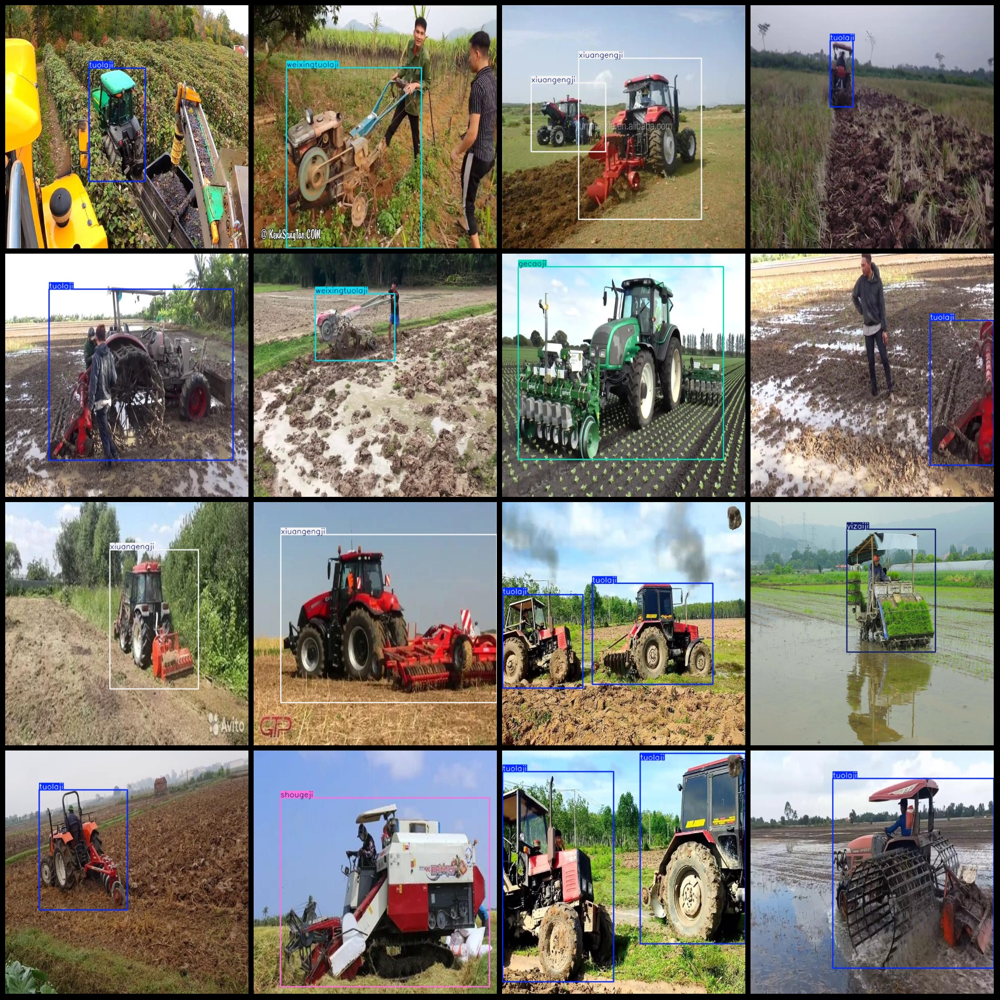
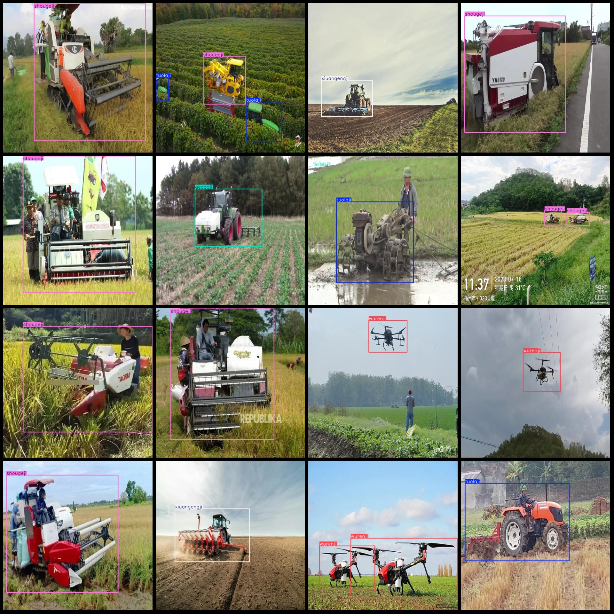

# Agricultural Machinery and Tool Inspection Data Set - VOC+YOLO Format with 7 Categories

Dataset format: Pascal VOC format + YOLO format (txt file without split path, only contains jpg images and corresponding VOC format xml files and YOLO format txt files)
The number of images (jpg file count): 7376.
Number of xml files: 7376
annotation count: 7376  
Category count: 7
["gecaoji", "shougeji", "tuolaji", "weixingtuolaji", "wurenji", "xiuangengji", "yizaiji"]
["Unmanned Aerial Vehicle", "Harvester", "Cultivator", "Transplanter", "Micro Tractor", "Grass Cutter", "Tractor"]
Number of bounding boxes per category:
gecaoji box count = 499  
shougeji box count = 1157  
Tuolaji box number = 2540
weixingtuolaji box count = 719  
The number of wurenji frames is 1129.
The frame count is 1170.
"yizaiji box count = 1074" is a Chinese sentence translated to English.
total boxes: 8288  
images per class:   
gecaoji images = 499  
shougeji images = 1046  
Total number of images owned by tuolaji = 2142
weixingtuolaji images = 659  
wurenji images = 981  
Xiuangengji's possession of images = 1113
yizaiji images = 990  
image resolution: 640x640  
Use annotation tool: labelImg
Rules of Annotation: Mark the categories with rectangles.
Important Note: The dataset does not have a division into training, validation, and test sets.
Special Notice: This dataset does not guarantee the accuracy of the trained model or weight files.
Image preview:
## Images

Here is a pay link on Stripe ( https://buy.stripe.com/3cs8yP7sY87d0vu9AB ). Please contact me lonlonago@foxmail.com after funding $89, and I will send you a complete data files , thank you!

